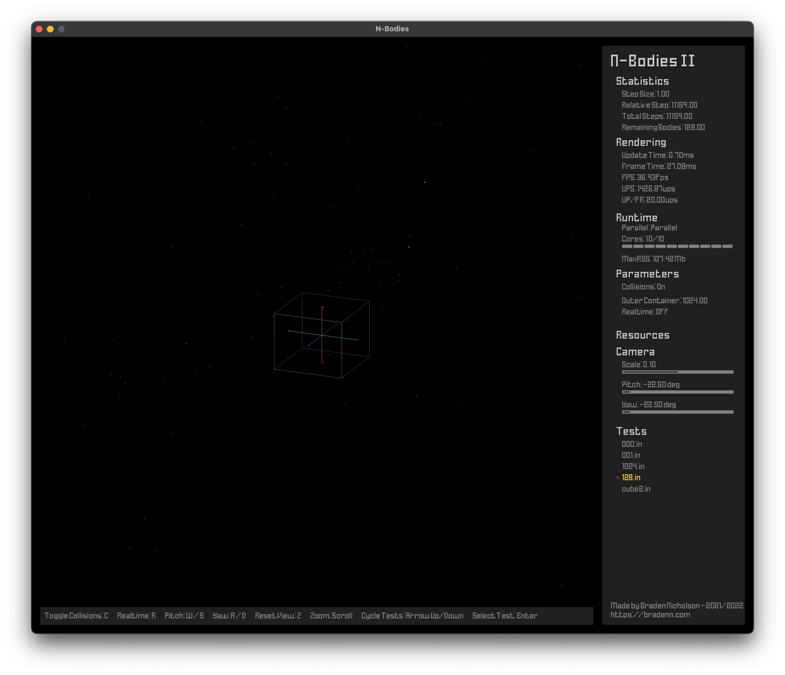
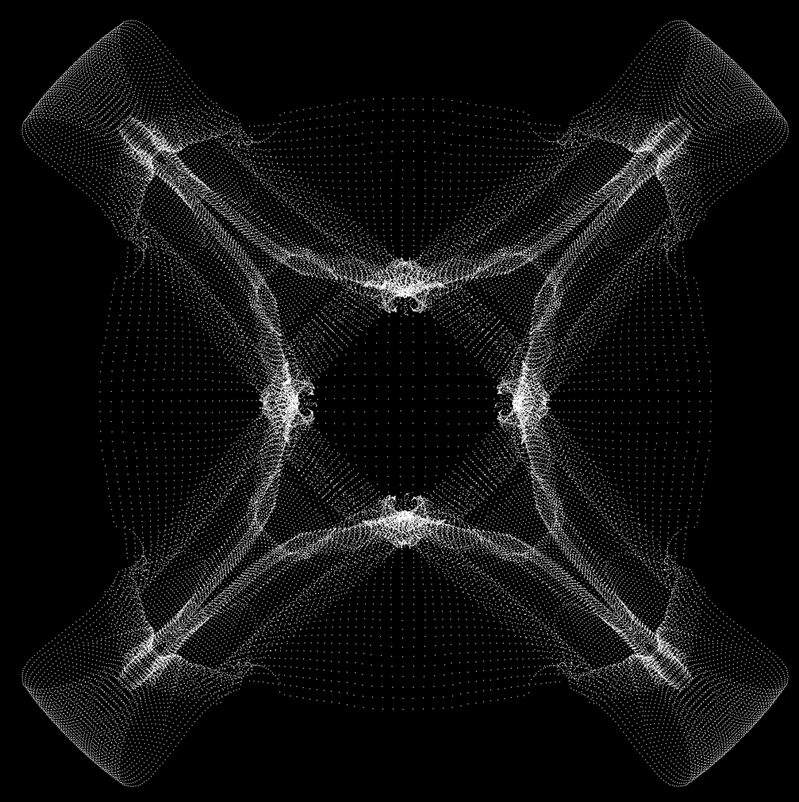
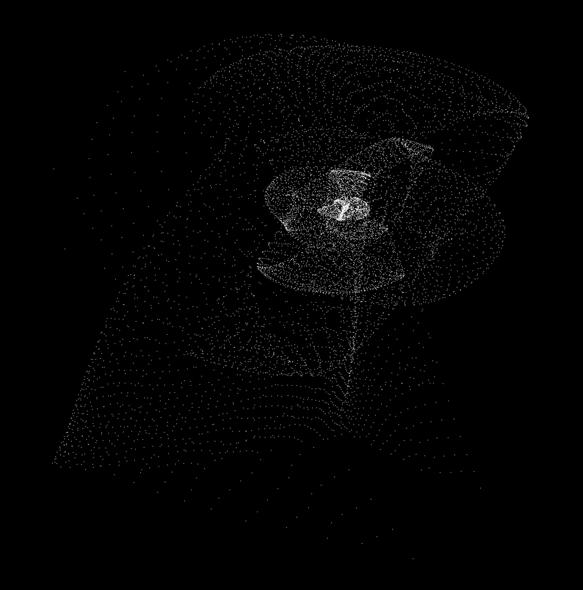
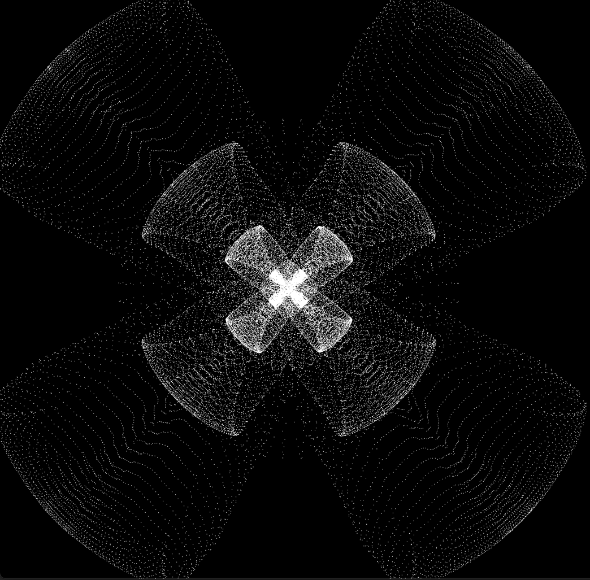

# N-Bodies Parallel Simulator

This program simulates the gravitational attraction and physical collisions of n-bodies on a macro scale.

### 1024 Random Bodies

### 1728 Bodies from a Cube shape

## Interesting Outputs

  

## Using Barnes-Hut
This iteration can be found in the archived folder, or at bradenn/barnes-hut

